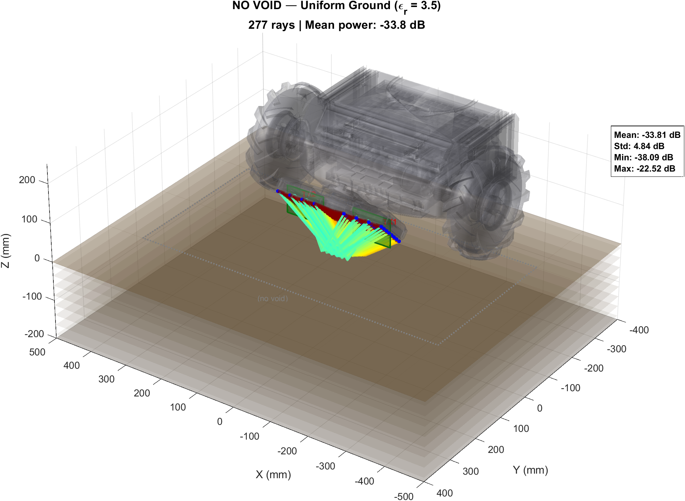
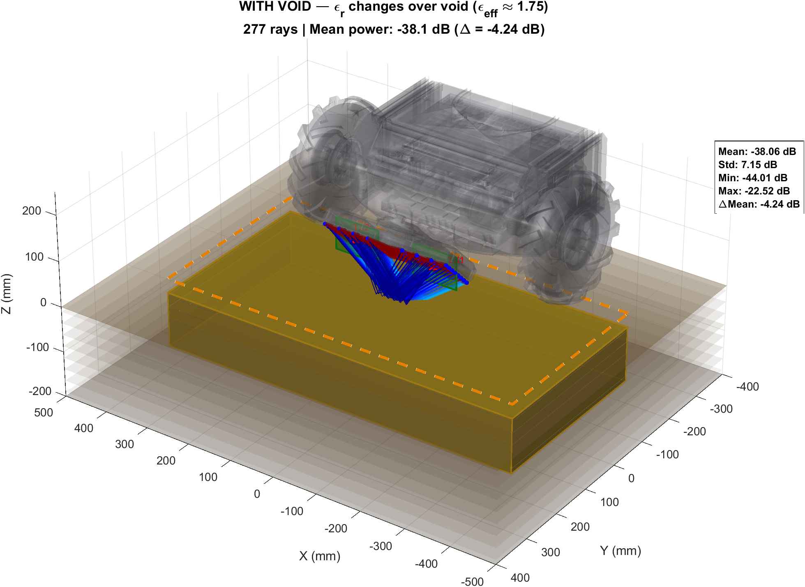
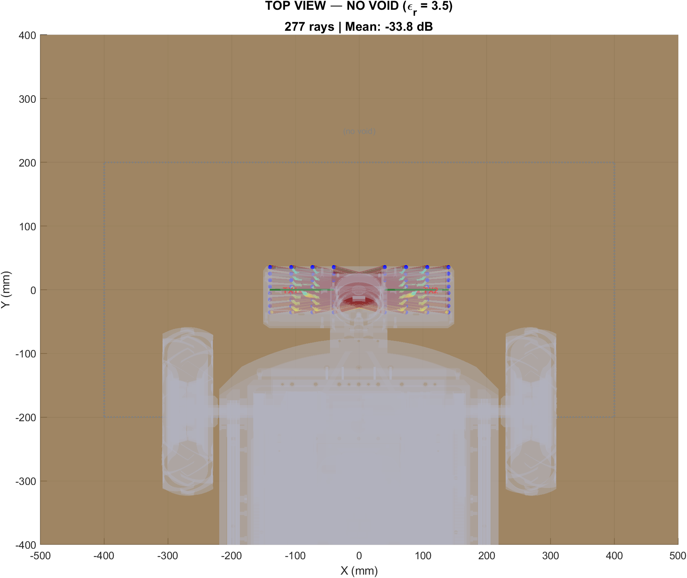
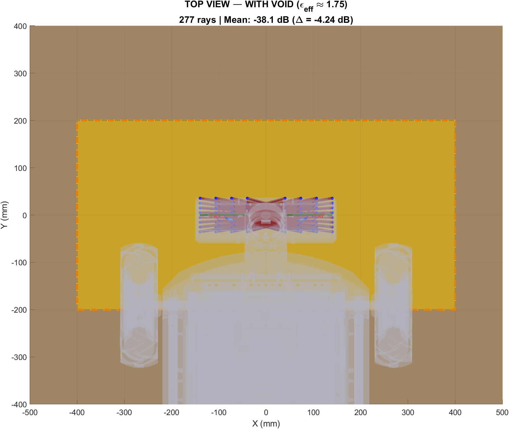

# Buried Object Ray Trace — Power Difference Summary

## Detection Mechanism

The buried void (air, εr=1) replaces solid ground (εr=3.5) at shallow depth. This changes the **effective dielectric constant** at the reflection interface, which alters the Fresnel reflection coefficient:

$$\Gamma = \frac{\cos\theta_i - \sqrt{\varepsilon_r}\cos\theta_t}{\cos\theta_i + \sqrt{\varepsilon_r}\cos\theta_t}$$

- **No void**: Γ computed with εr=3.5 → certain reflected power
- **With void**: Γ computed with lower effective εr → different reflected power

The ray paths don't change. The **amplitude** of the reflected signal does. Across 32 receivers, each seeing slightly different Γ depending on its bounce angle and whether it hits the void footprint, the ML classifier picks up the systematic pattern of RSSI shifts.

**void changes εr → changes reflection coefficient → changes received power → classifier detects the pattern**

| Parameter | No Void | With Void |
|-----------|---------|-----------|
| Ground εr | 3.5 (dry sand) | 3.5 (uniform areas) |
| Effective εr over void | — | ~1.75 |
| Mean received power | -33.8 dB | -38.1 dB |
| **Power shift (Δ)** | — | **-5.52 dB mean, 6.19 dB max** |
| Rays affected | 0 / 277 | 213 / 277 |

## How It Works

1. SBR traces 277 rays (criss-cross TX1→RX2, TX2→RX1 architecture)
2. At each ground bounce, the Fresnel TE reflection coefficient is computed:
   - **No void**: Γ = f(θ_i, εr=3.5) everywhere
   - **With void**: Γ = f(θ_i, εr_eff≈1.75) for bounces within the void footprint (±400mm × ±200mm)
3. Lower εr → different reflection coefficient → measurable RSSI change
4. The ML classifier detects this Δ across 32 receivers simultaneously

## Output Figures

### 3D Perspective View

**No Void — Uniform Ground:**



**With Void — Power Reduction Visible:**



### Top View (Bird's Eye)

**No Void:**



**With Void:**



## Regeneration

From `RobotSimulationAnalysis/BumpyTerrainAnalysis/`:

```
matlab -batch "QuickView_BuriedObject_RayTrace"
```

Requires: Communications Toolbox (SBR ray tracing), robot STL file, `SimConfig.m`.
