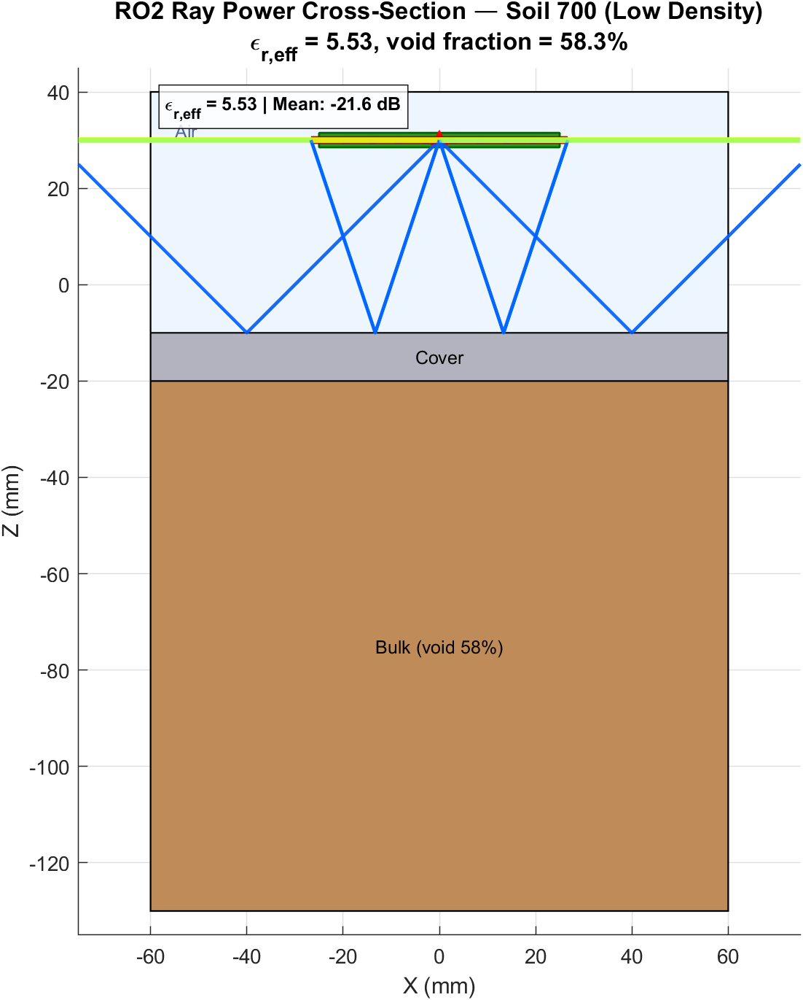
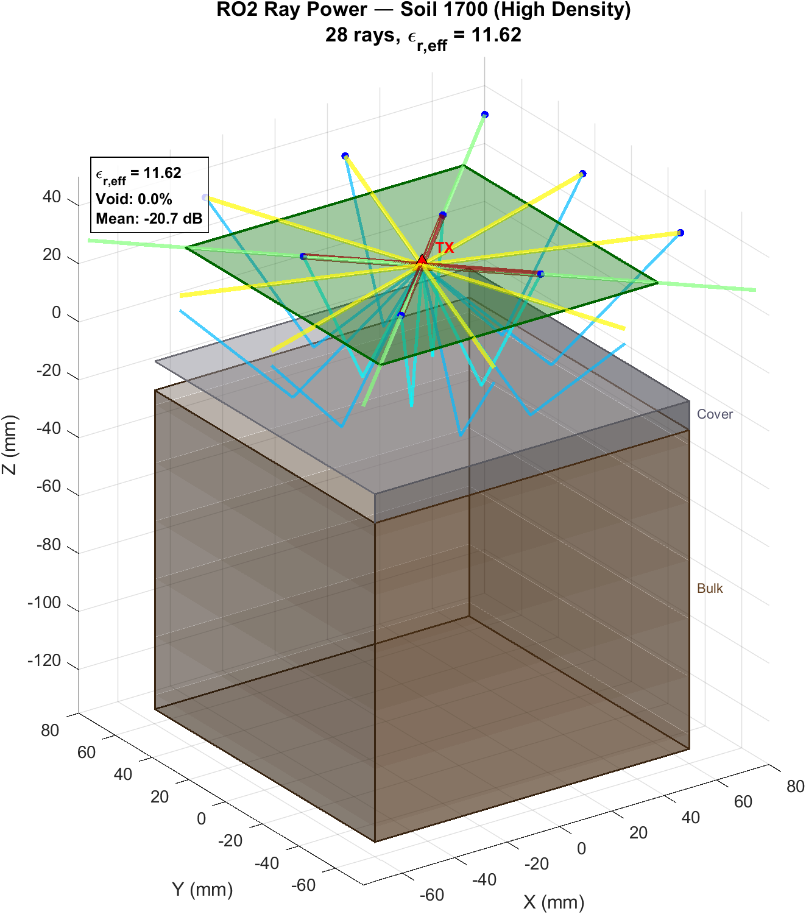
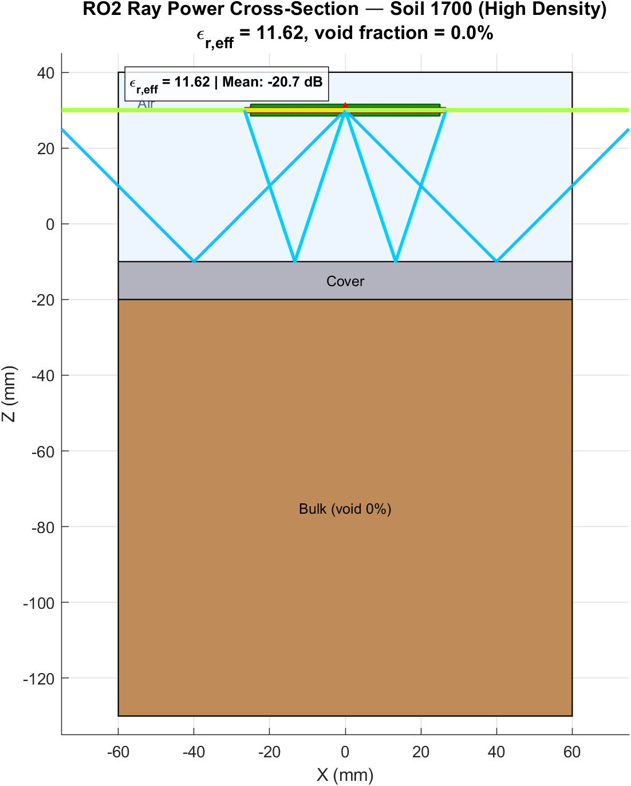
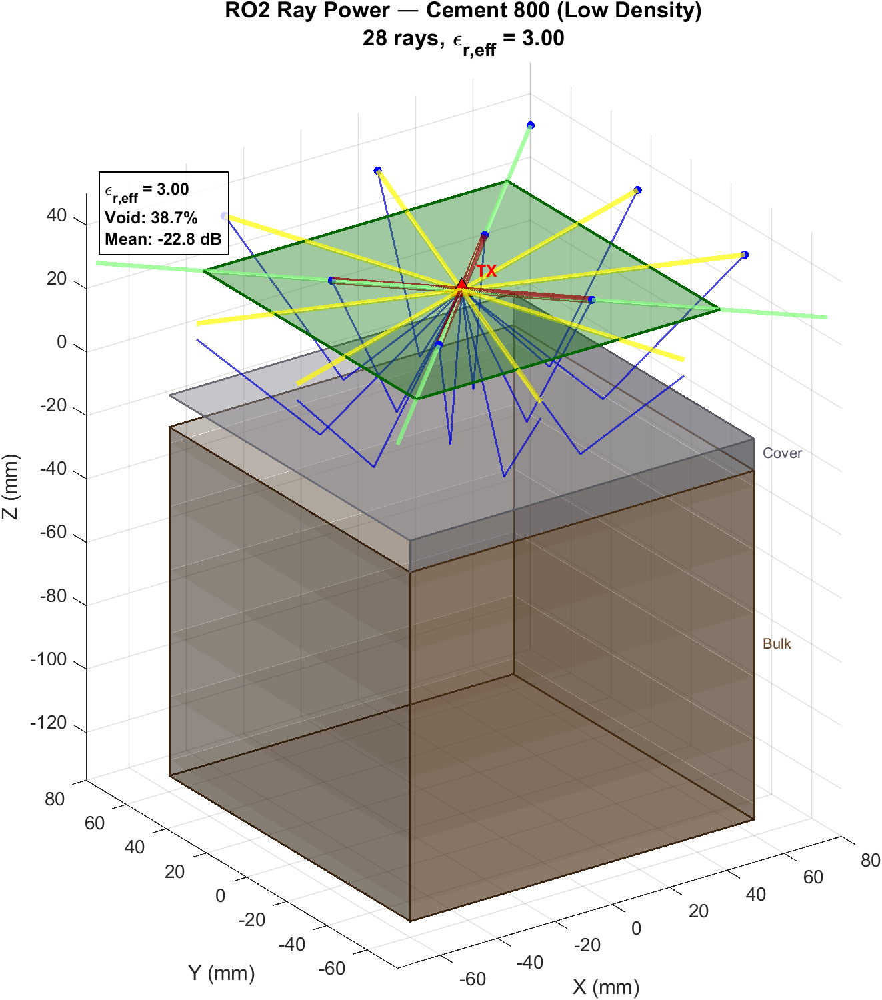
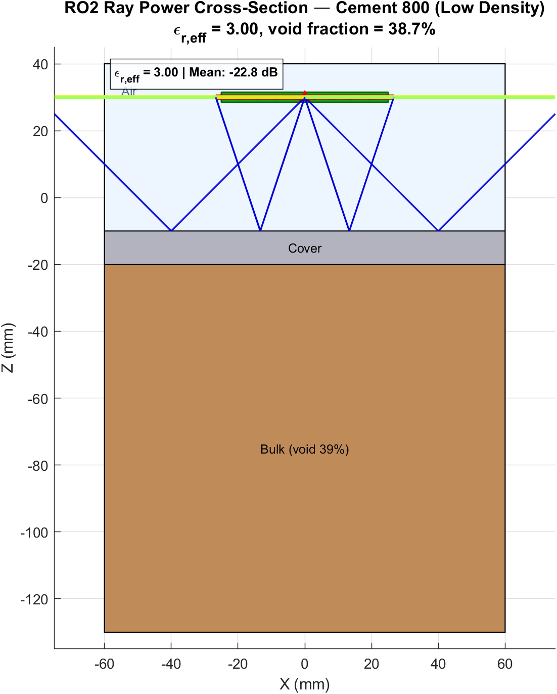
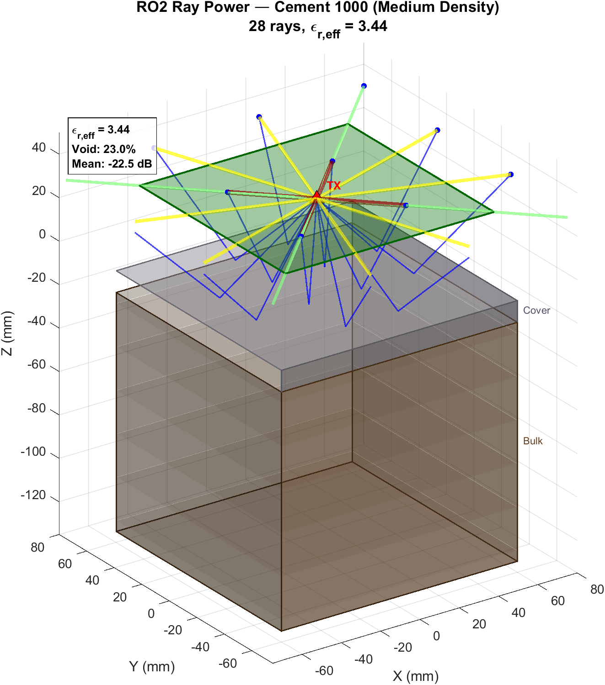
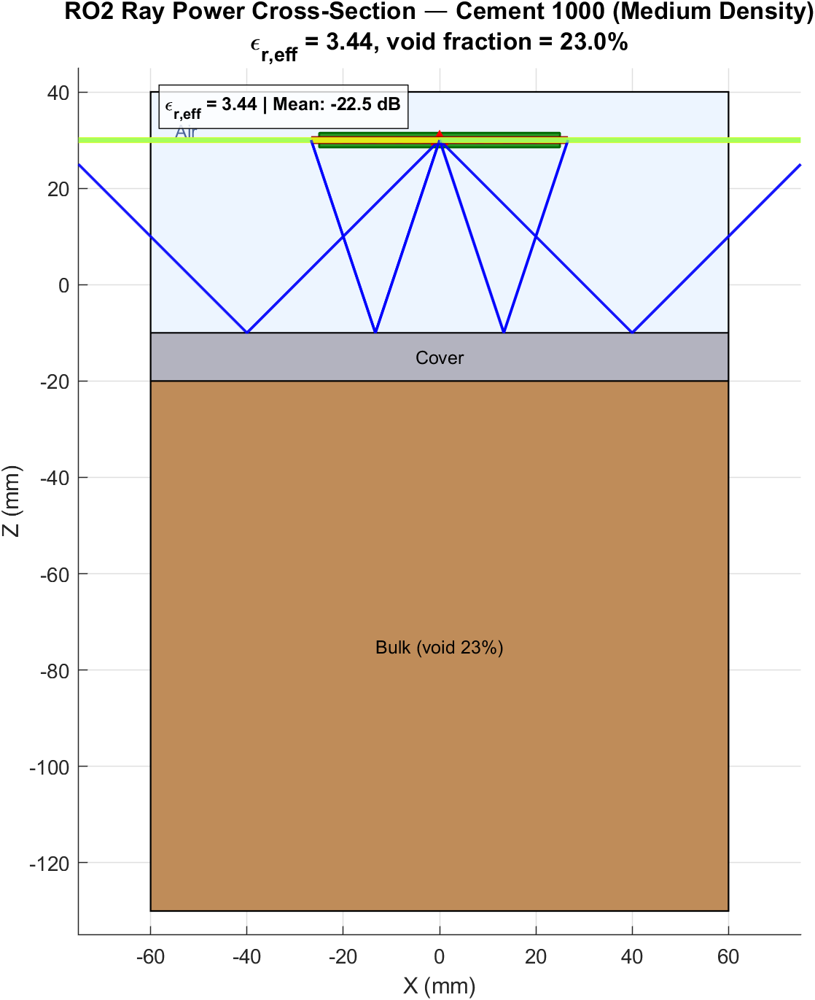
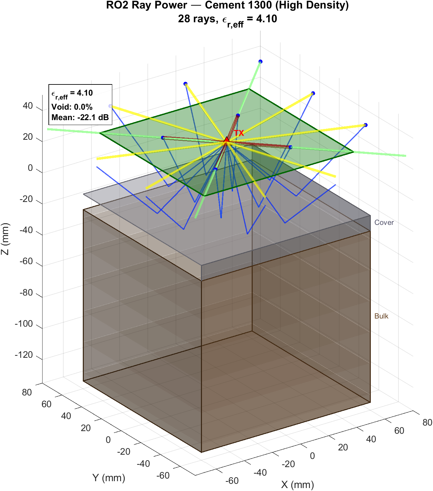
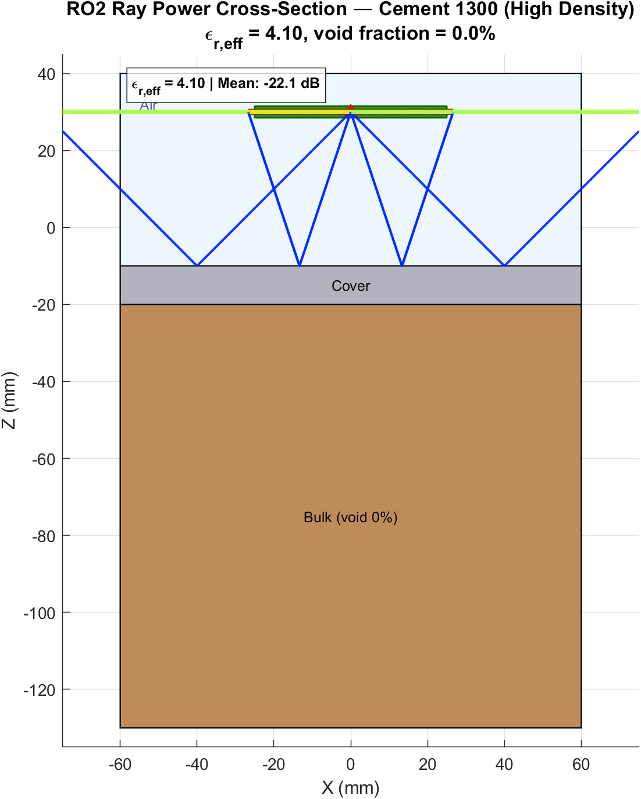

# RO2 Fresnel Power Analysis — 6 Density Cases

## Overview

This document summarises the Fresnel reflection-based power simulation for the RO2 antenna configuration across **3 soil densities** and **3 cement densities**. The effective-medium model is used to derive the bulk permittivity from void fraction:

$$
\varepsilon_{r,\text{eff}} = (1 - v_f)\,\varepsilon_{r,\text{solid}} + v_f\,\varepsilon_{r,\text{void}}
$$

where $v_f = 1 - \rho / \rho_{\max}$.

---

## Material Parameters

| Parameter | Soil | Cement |
|-----------|------|--------|
| $\varepsilon_{r,\text{solid}}$ | 12.0 | 4.0 |
| $\sigma$ (S/m) | 0.03 | 0.008 |
| $\rho_{\max}$ (g/cm³) | 0.84 | 2.17 |
| Cover layer $\varepsilon_r$ | 4.5 (ConcreteSlab) | 6.0 (Tile) |
| Cover thickness | 10 mm | 10 mm |

---

## Density Cases Summary

| # | Material | Mass (g) | Density (g/cm³) | Void Fraction | $\varepsilon_{r,\text{eff}}$ | Mean Power (dB) |
|---|----------|----------|-----------------|---------------|------------------------------|-----------------|
| 1 | Soil     | 700      | 0.35            | 58.3%         | 5.53                         | −21.6           |
| 2 | Soil     | 1100     | 0.55            | 34.5%         | 8.02                         | −21.1           |
| 3 | Soil     | 1700     | 0.84            | 0.0%          | 11.62                        | −20.7           |
| 4 | Cement   | 800      | 1.33            | 38.7%         | 3.00                         | −22.8           |
| 5 | Cement   | 1000     | 1.67            | 23.0%         | 3.44                         | −22.5           |
| 6 | Cement   | 1300     | 2.17            | 0.0%          | 4.10                         | −22.1           |

### Power Ranges

- **Soil:** 0.88 dB spread (700 g → 1700 g)
- **Cement:** 0.71 dB spread (800 g → 1300 g)

---

## Figures

### Soil 700 g (Low Density)
| 3D View | Cross-Section |
|---------|---------------|
|  |  |

### Soil 1100 g (Medium Density)
| 3D View | Cross-Section |
|---------|---------------|
|  |  |

### Soil 1700 g (High Density)
| 3D View | Cross-Section |
|---------|---------------|
|  |  |

### Cement 800 g (Low Density)
| 3D View | Cross-Section |
|---------|---------------|
|  |  |

### Cement 1000 g (Medium Density)
| 3D View | Cross-Section |
|---------|---------------|
|  |  |

### Cement 1300 g (High Density)
| 3D View | Cross-Section |
|---------|---------------|
|  |  |

---

## Interpretation

1. **Higher density → higher εr_eff → stronger reflection → higher received power.**  
2. Soil shows a larger εr range (5.53–11.62) than cement (3.00–4.10) due to higher base permittivity.  
3. Despite the larger εr range, the power spread is modest (~0.7–0.9 dB) because the Fresnel coefficient saturates at high εr contrast.  
4. The cover layer (Tile for cement, ConcreteSlab for soil) introduces an additional reflection interface that slightly attenuates the density-dependent contrast.

---

## Antenna Configuration

- **TX:** Single transmitter at (0, 0, 30 mm)
- **RX:** 4×4 grid on 160×160 mm at z = 30 mm
- **Terrain:** 200×200×200 mm block; cover layer 10 mm thick
- **Tilt:** 90° (straight down)
- **Ray paths:** 28 (TX→surface→RX for each receiver, direct + 1-bounce)

---

## Generated Files

| File | Description |
|------|-------------|
| `ro2_power_soil_700_3d.fig/.png` | Soil 700 g – 3D power-coded rays |
| `ro2_power_soil_700_cross_section.fig/.png` | Soil 700 g – XZ cross-section |
| `ro2_power_soil_1100_3d.fig/.png` | Soil 1100 g – 3D power-coded rays |
| `ro2_power_soil_1100_cross_section.fig/.png` | Soil 1100 g – XZ cross-section |
| `ro2_power_soil_1700_3d.fig/.png` | Soil 1700 g – 3D power-coded rays |
| `ro2_power_soil_1700_cross_section.fig/.png` | Soil 1700 g – XZ cross-section |
| `ro2_power_cement_800_3d.fig/.png` | Cement 800 g – 3D power-coded rays |
| `ro2_power_cement_800_cross_section.fig/.png` | Cement 800 g – XZ cross-section |
| `ro2_power_cement_1000_3d.fig/.png` | Cement 1000 g – 3D power-coded rays |
| `ro2_power_cement_1000_cross_section.fig/.png` | Cement 1000 g – XZ cross-section |
| `ro2_power_cement_1300_3d.fig/.png` | Cement 1300 g – 3D power-coded rays |
| `ro2_power_cement_1300_cross_section.fig/.png` | Cement 1300 g – XZ cross-section |

---

*Generated by `s60_generate_ro2_figures.m`*
