# RO2 — Single-Antenna Material Density Classification

## Experiment Overview

This experiment investigates whether a single downward-facing antenna array can classify material density through a cover layer using only raw RSSI measurements. The approach models subsurface voids as discrete 5×5×5 mm air pockets within a bulk material, where varying void fractions produce different effective densities. A multi-layer perceptron (MLP) is trained on 32 RSSI features (16 RX elements × 2 TX power levels) to discriminate between 12 density classes spanning two material groups.

---

## Experimental Setup

### Antenna Array

| Parameter | Value |
|-----------|-------|
| Configuration | 8 × 4 patch array + 1 TX (centre) |
| Total elements | 33 (32 RX + 1 TX) |
| PCB dimensions | 100 mm × 100 mm (FR4, 1.6 mm) |
| Operating frequency | 2.45 GHz (ISM band) |
| Wavelength | 122.4 mm |
| TX/RX gain | 2.0 dBi |
| Height above surface | 30 mm |
| Orientation | Boresight straight down (90° tilt) |

### Material Block Geometry

| Parameter | Value |
|-----------|-------|
| Block dimensions | 200 × 200 × 200 mm |
| Cover layer | 10 mm thick (Z = −10 to −20 mm) |
| Bulk layer | 190 mm thick (Z = −20 to −210 mm) |
| Void size | 5 × 5 × 5 mm cubes |
| Void grid | 40 × 40 × 38 = 60,800 possible cells |
| Material variation | ±2% random perturbation per sample |

### Layer Materials

| Layer | Material (Cement group) | Material (Soil group) |
|-------|------------------------|----------------------|
| Cover | Tile (εr = 6.0, σ = 0.01 S/m) | Concrete slab (εr = 4.5, σ = 0.006 S/m) |
| Bulk | Cement (εr = 4.0, σ = 0.008 S/m) | Soil (εr = 12.0, σ = 0.03 S/m) |
| Voids | Air (εr = 1.0, σ = 0.0 S/m) | Air (εr = 1.0, σ = 0.0 S/m) |

### RF Channel Model

- Two-ray model: direct path + reflected path via cover surface
- Fresnel reflection coefficients at air/cover and cover/bulk interfaces
- Coherent combination with phase (constructive/destructive interference)
- Cover layer attenuation (round-trip through 10 mm cover)
- Spatial diversity: each RX element computes local void fraction within a 3-cell footprint radius around its reflection point
- Measurement noise: σ = 0.05 dB

### TX Power Levels

| Level | Range |
|-------|-------|
| Low | −4 to −2 dBm |
| High | 0 to +2 dBm |

### Setup Visualisation

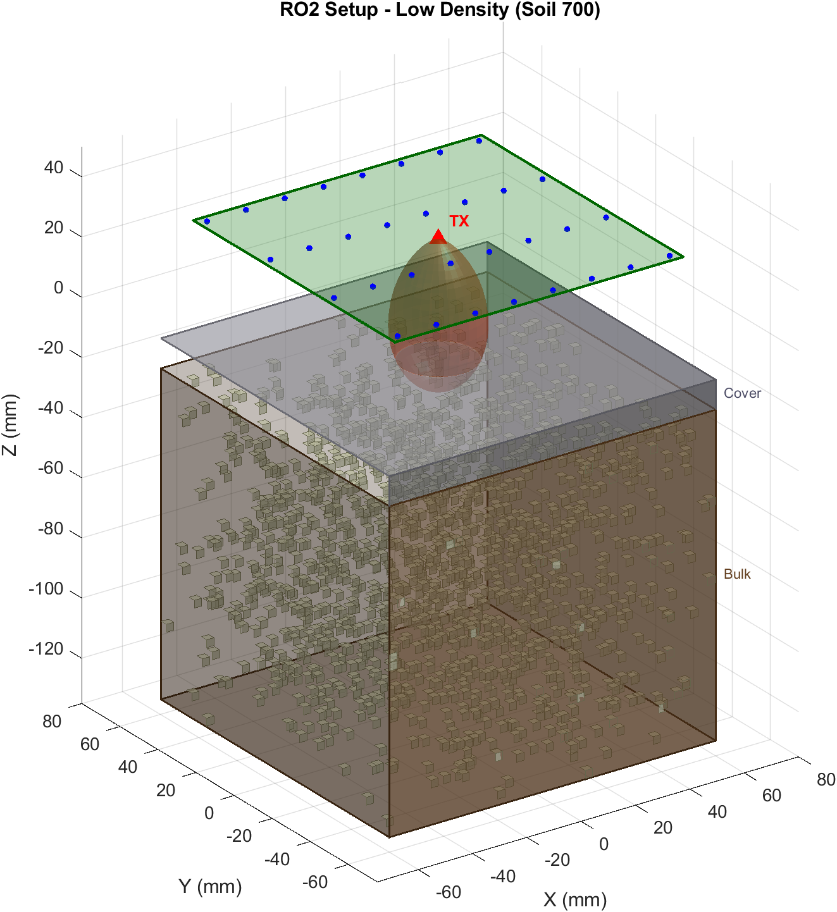
*Figure 1: Low density sample (Soil 700) — 58.3% void fraction, bulk heavily perforated.*

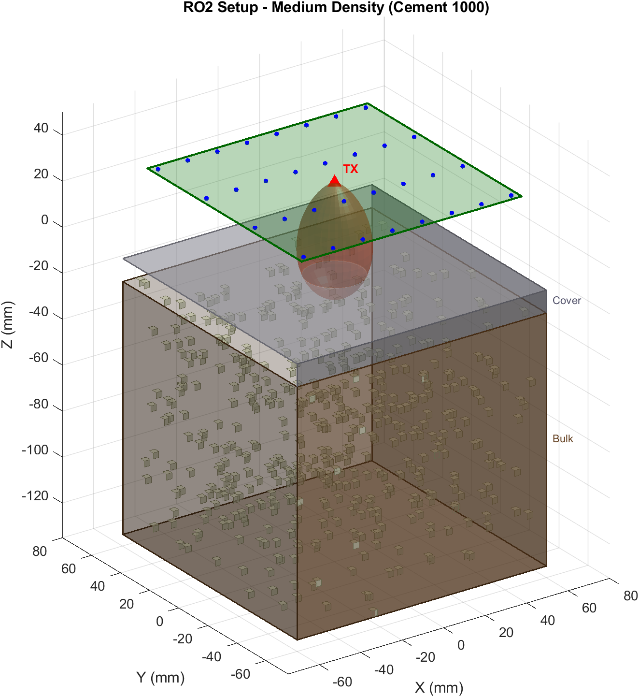
*Figure 2: Medium density sample (Cement 1000) — 23.0% void fraction.*

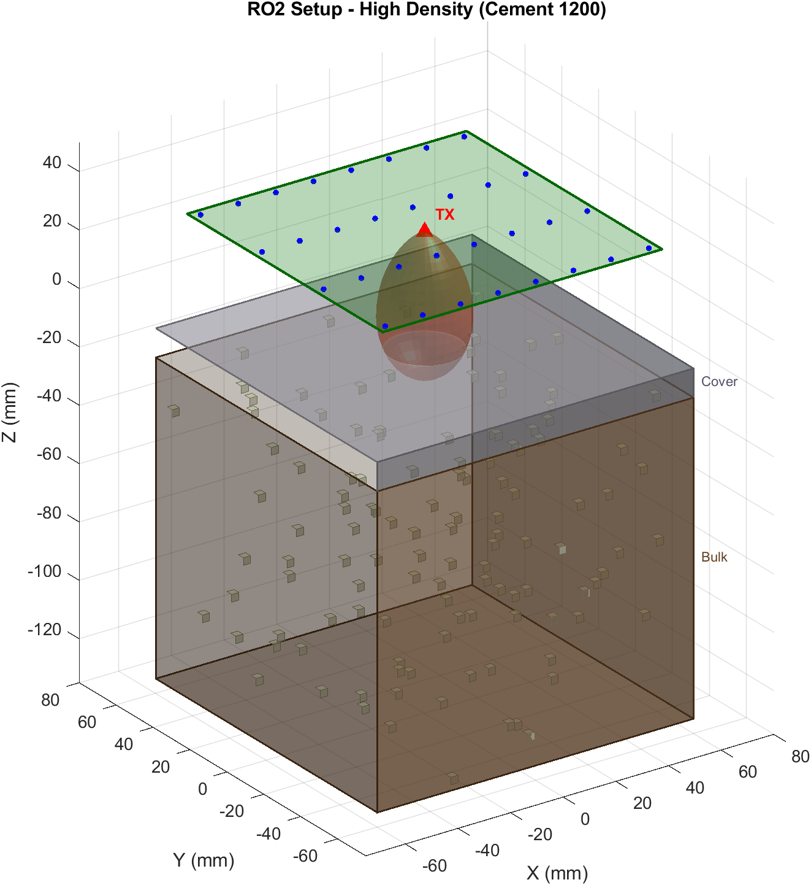
*Figure 3: High density sample (Cement 1200) — 7.8% void fraction, mostly solid.*

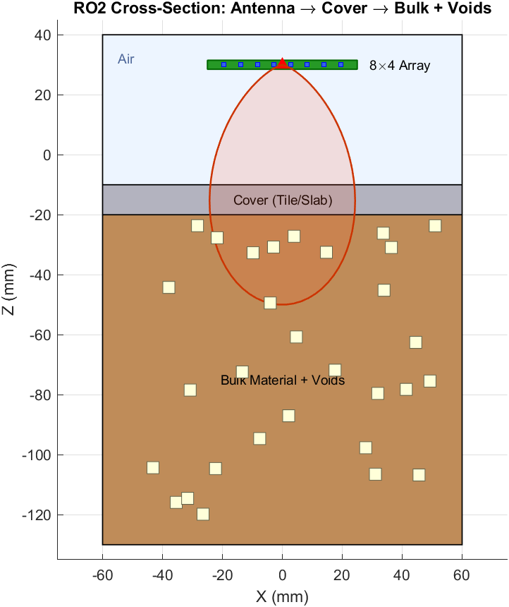
*Figure 4: 2D cross-section showing antenna, cover layer, and bulk with voids.*

---

## Density Classes

### Cement Group (Tile cover, 6 classes)

| Class | Mass (g) | Target Density (g/cm³) | Void Fraction |
|-------|----------|----------------------|---------------|
| Cement 800 | 800 | 1.33 | 38.7% |
| Cement 900 | 900 | 1.50 | 30.9% |
| Cement 1000 | 1000 | 1.67 | 23.0% |
| Cement 1100 | 1100 | 1.83 | 15.7% |
| Cement 1200 | 1200 | 2.00 | 7.8% |
| Cement 1300 | 1300 | 2.17 | 0.0% (solid) |

### Soil Group (Concrete slab cover, 6 classes)

| Class | Mass (g) | Target Density (g/cm³) | Void Fraction |
|-------|----------|----------------------|---------------|
| Soil 700 | 700 | 0.35 | 58.3% |
| Soil 900 | 900 | 0.45 | 46.4% |
| Soil 1100 | 1100 | 0.55 | 34.5% |
| Soil 1300 | 1300 | 0.65 | 22.6% |
| Soil 1500 | 1500 | 0.74 | 11.9% |
| Soil 1700 | 1700 | 0.84 | 0.0% (solid) |

Solid reference densities: Cement = 2.17 g/cm³, Soil = 0.84 g/cm³.

---

## Dataset

| Parameter | Value |
|-----------|-------|
| Total samples | 2,400 (200 per class × 12 classes) |
| Features per sample | 32 (16 RX × 2 power levels) |
| Feature type | Raw RSSI (dBm) |
| RSSI range | −39.97 to −30.15 dBm |
| RSSI mean | −34.88 dBm |
| RSSI std | 2.36 dB |
| Train/test split | 80% / 20% (stratified) |
| Training set | 1,920 samples |
| Test set | 480 samples (40 per class) |

### Dataset Figures

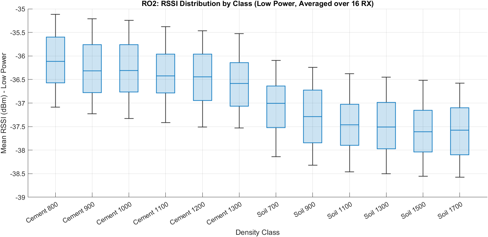
*Figure 5: RSSI distribution per class at low TX power.*

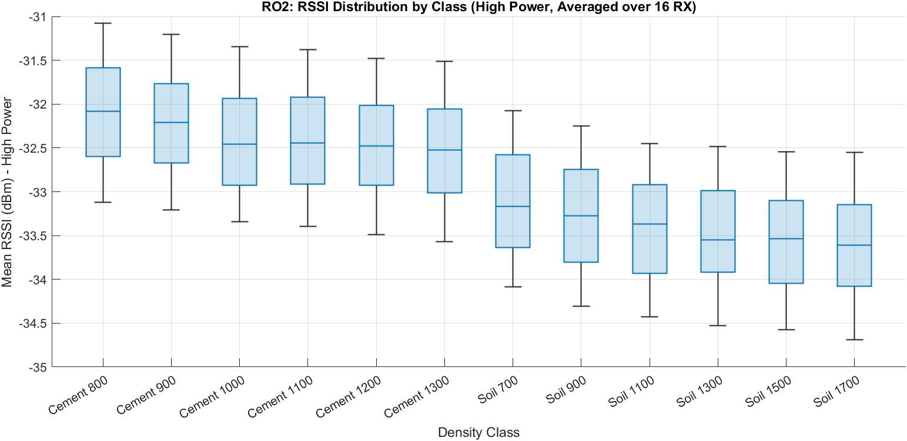
*Figure 6: RSSI distribution per class at high TX power.*

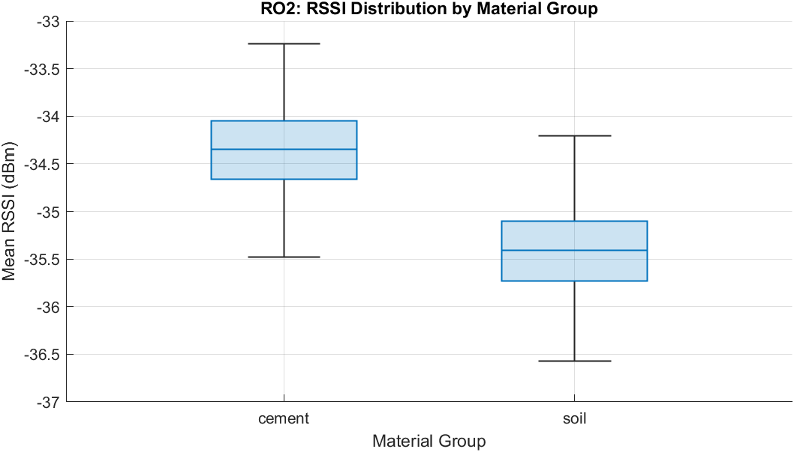
*Figure 7: RSSI separation between cement and soil material groups.*

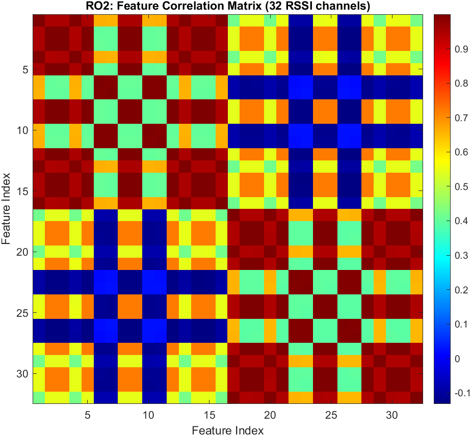
*Figure 8: Correlation matrix across 32 RSSI features.*

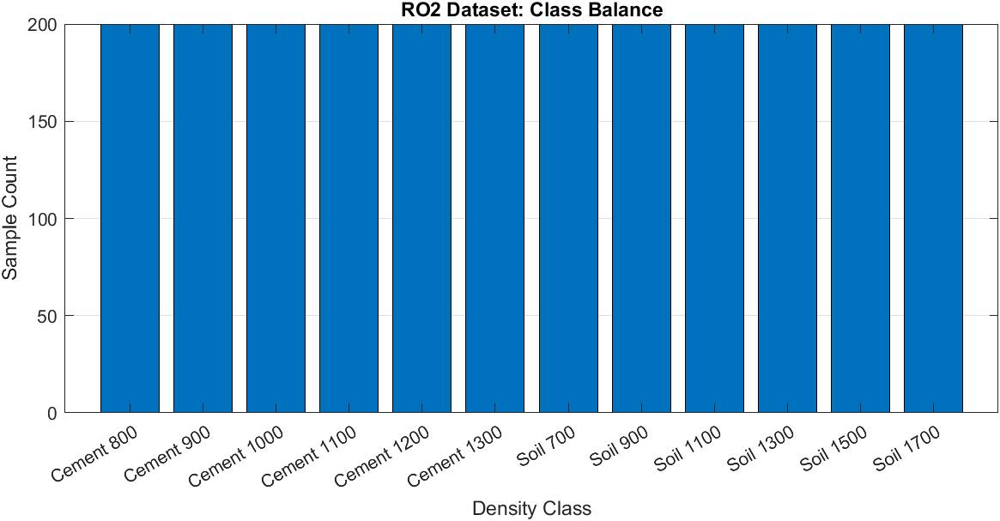
*Figure 9: Sample count per class (balanced at 200 each).*

### Per-Class Mean RSSI

| Class | Mean RSSI (dBm) |
|-------|-----------------|
| Cement 800 | −34.10 |
| Cement 900 | −34.23 |
| Cement 1000 | −34.35 |
| Cement 1100 | −34.41 |
| Cement 1200 | −34.47 |
| Cement 1300 | −34.56 |
| Soil 700 | −35.10 |
| Soil 900 | −35.27 |
| Soil 1100 | −35.43 |
| Soil 1300 | −35.48 |
| Soil 1500 | −35.57 |
| Soil 1700 | −35.61 |

---

## MLP Classifier

### Architecture

| Parameter | Value |
|-----------|-------|
| Type | Multi-Layer Perceptron (fitcnet) |
| Hidden layers | [128, 64, 32] |
| Activation | ReLU |
| Input standardization | Yes |
| Max iterations | 2,000 |
| Gradient tolerance | 1×10⁻⁷ |
| Training balancing | Oversampling (equal class representation) |

### Training Performance

| Metric | Value |
|--------|-------|
| Final training loss | 0.0166 |
| Training accuracy | 91.72% |
| Training time | 15.1 seconds |

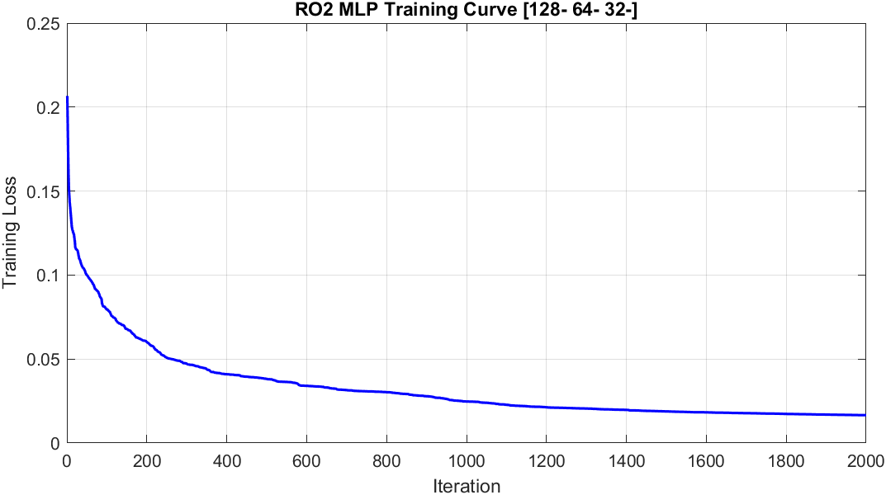
*Figure 10: MLP training loss curve over iterations.*

---

## Results

### Overall Performance

| Metric | Value |
|--------|-------|
| **Test Accuracy** | **87.71%** |
| **Macro F1 Score** | **0.878** |
| Macro Precision | 0.882 |
| Macro Recall | 0.877 |

### Per-Class Performance

| Class | Precision | Recall | F1 Score | Support |
|-------|-----------|--------|----------|---------|
| Cement 800 | 1.000 | 1.000 | 1.000 | 40 |
| Cement 900 | 0.951 | 0.975 | 0.963 | 40 |
| Cement 1000 | 0.925 | 0.925 | 0.925 | 40 |
| Cement 1100 | 0.944 | 0.850 | 0.895 | 40 |
| Cement 1200 | 0.792 | 0.950 | 0.864 | 40 |
| Cement 1300 | 0.971 | 0.850 | 0.907 | 40 |
| Soil 700 | 1.000 | 1.000 | 1.000 | 40 |
| Soil 900 | 0.951 | 0.975 | 0.963 | 40 |
| Soil 1100 | 0.919 | 0.850 | 0.883 | 40 |
| Soil 1300 | 0.821 | 0.800 | 0.810 | 40 |
| Soil 1500 | 0.591 | 0.650 | 0.619 | 40 |
| Soil 1700 | 0.718 | 0.700 | 0.709 | 40 |

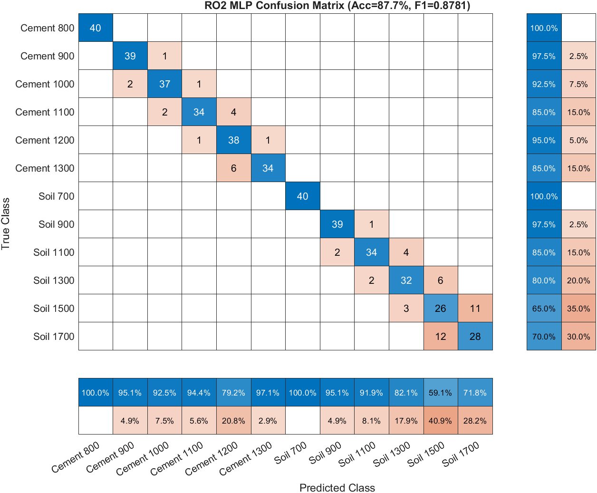
*Figure 11: Confusion matrix on test set (480 samples).*

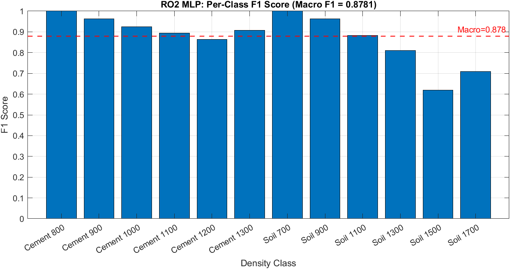
*Figure 12: Per-class F1 scores.*

### Key Observations

1. **Perfect classification** for extreme density classes (Cement 800, Soil 700) where void fraction differences are largest.
2. **Strong performance** (F1 > 0.90) for classes with void fractions above 30%.
3. **Reduced accuracy** for high-density classes with small void fractions (Soil 1500, Soil 1700) where the effective permittivity difference between adjacent classes is minimal.
4. **Material group separation** is robust — cement and soil classes are never confused with each other due to distinct base permittivity values (εr = 4.0 vs 12.0).
5. **Spatial diversity** is critical — local void fraction computation per RX element provides the discriminative signal that enables density classification from a stationary antenna.

---

## Pipeline Execution

| Step | Script | Duration |
|------|--------|----------|
| Geometry generation | `s10_generate_ro2_geometry.m` | ~2 s |
| RSSI simulation | `s20_simulate_ro2_rssi_dataset.m` | ~3 s |
| Dataset review | `s30_review_ro2_dataset.m` | ~5 s |
| MLP training | `s40_train_ro2_mlp.m` | ~15 s |
| MLP evaluation | `s50_evaluate_ro2_mlp.m` | ~3 s |
| Figure generation | `s60_generate_ro2_figures.m` | ~23 s |
| **Total** | `run_all_RO2.m` | **~51 s** |

---

## Output Files

```
RO2/
├── data/raw/
│   ├── ro2_geometry.mat          % Void placements for all 2400 samples
│   ├── ro2_rssi_dataset.mat      % 2400×32 RSSI matrix + labels
│   └── ro2_rssi_dataset.csv      % CSV export of dataset
├── models/
│   └── ro2_mlp_model.mat         % Trained MLP model
├── results/
│   ├── ro2_mlp_results.mat       % Evaluation metrics
│   └── ro2_mlp_results.csv       % Per-class results table
└── figures/
    ├── setup/
    │   ├── ro2_setup_low_density.{fig,png}
    │   ├── ro2_setup_medium_density.{fig,png}
    │   ├── ro2_setup_high_density.{fig,png}
    │   └── ro2_cross_section.{fig,png}
    ├── dataset/
    │   ├── rssi_by_class_low.{fig,png}
    │   ├── rssi_by_class_high.{fig,png}
    │   ├── rssi_by_material_group.{fig,png}
    │   ├── feature_correlation.{fig,png}
    │   ├── class_balance.{fig,png}
    │   └── rssi_response_representative.{fig,png}
    ├── training/
    │   ├── mlp_training_curve.{fig,png}
    │   └── per_class_f1.{fig,png}
    └── confusion_matrices/
        └── confusion_matrix_mlp.{fig,png}
```

---

## How to Reproduce

From `RobotSimulationAnalysis/RO2/`:

```matlab
matlab -batch "run_all_RO2"
```

Or step-by-step:

```matlab
matlab -batch "addpath('config'); ro2_config; ro2_root=pwd; s10_generate_ro2_geometry"
matlab -batch "addpath('config'); ro2_config; ro2_root=pwd; s20_simulate_ro2_rssi_dataset"
matlab -batch "addpath('config'); ro2_config; ro2_root=pwd; s30_review_ro2_dataset"
matlab -batch "addpath('config'); ro2_config; ro2_root=pwd; s40_train_ro2_mlp"
matlab -batch "addpath('config'); ro2_config; ro2_root=pwd; s50_evaluate_ro2_mlp"
matlab -batch "addpath('config'); ro2_config; ro2_root=pwd; s60_generate_ro2_figures"
```

---

## Requirements

- MATLAB R2024b (or later)
- Statistics and Machine Learning Toolbox (`fitcnet`, `cvpartition`)
