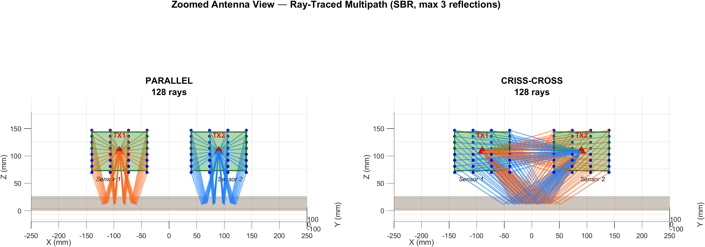

# RO3: Terrain Classification — Architecture Comparison

## Architecture Diagram

**Left — Parallel:** TX1 transmits to RX1 (same board), TX2 transmits to RX2 (same board). Rays stay within each sensor's ground footprint — narrow coverage directly below each board.

**Right — Criss-Cross:** TX1 transmits to RX2 (opposite board), TX2 transmits to RX1 (opposite board). Rays cross between the two sensors, covering the entire 180mm ground zone between them with diverse reflection angles.

Both diagrams computed using MATLAB SBR ray tracing (Communications Toolbox) with max 3 reflections on a DrySand surface (εr=3.5, σ=0.001). 128 rays per architecture.

## Objective

Compare criss-cross vs parallel (same-antenna) architecture for
**terrain classification only** (no hidden objects).

Hypothesis: both architectures should achieve similar high accuracy
since terrain classification relies on surface reflection properties
(Fresnel coefficient) which determines the absolute RSSI level.

## Configuration

| Parameter | Value |
|-----------|-------|
| Frequency | 2.45 GHz |
| RX Array | 4x8 = 32 elements |
| Sensor Separation | 180 mm |
| Track Length | 20 m per terrain |
| Positions/terrain | 2001 (10mm step) |
| Window | 50 positions (300mm), stride 15 (100mm) |
| Windows/terrain | 131 (overlapping) |
| Total Samples | 1572 |
| Terrains | 12 |
| Objects | None (solid terrain) |
| Surface | Bumpy (0-2mm random, +/-3% property variation) |
| Noise | 0.30 dB std |
| PCA | 95% variance retained |
| PCA Components | Criss=9, Parallel=13 |
| Train/Test | 80%/20% stratified |

## Terrain Properties (at 2.45 GHz)

| # | Terrain | er | sigma (S/m) | Source |
|---|---------|-----|---------|--------|
| 1 | Asphalt | 4.0 | 0.006 | ITU-R P.527 / GPR literature |
| 2 | CoarseAsphalt | 5.5 | 0.004 | ITU-R P.527 / GPR literature |
| 3 | Cement | 6.0 | 0.014 | ITU-R P.527 / GPR literature |
| 4 | Bricks | 4.5 | 0.020 | ITU-R P.527 / GPR literature |
| 5 | DryGrass | 2.8 | 0.001 | ITU-R P.527 / GPR literature |
| 6 | WetGrass | 14.0 | 0.050 | ITU-R P.527 / GPR literature |
| 7 | DrySand | 3.5 | 0.001 | ITU-R P.527 / GPR literature |
| 8 | WetSand | 20.0 | 0.060 | ITU-R P.527 / GPR literature |
| 9 | Gravel | 7.0 | 0.005 | ITU-R P.527 / GPR literature |
| 10 | RedSoil | 10.0 | 0.025 | ITU-R P.527 / GPR literature |
| 11 | RedRocks | 6.5 | 0.010 | ITU-R P.527 / GPR literature |
| 12 | RubberTrack | 2.5 | 0.002 | ITU-R P.527 / GPR literature |

## Training Pipeline

1. Simulate 20m of travel per terrain (2001 positions)
2. Extract overlapping windows (300mm window, 100mm stride)
3. Compute 158 features per window (means, variances, stats, gradients)
4. Standardize features (zero mean, unit variance)
5. PCA dimensionality reduction (95% variance retained)
6. Train 5 classifiers: MLP, SVM-RBF, KNN, BaggedTrees, BoostedTrees
7. Evaluate on 20% held-out test set

## Classifiers

| # | Classifier | Config |
|---|-----------|--------|
| 1 | MLP | [256,128,64], standardized, 3000 iter |
| 2 | SVM-RBF | Gaussian kernel, auto scale, one-vs-one |
| 3 | KNN | k=5, Euclidean, standardized |
| 4 | BaggedTrees | 300 trees, max 100 splits |
| 5 | BoostedTrees | AdaBoostM2, 300 learners, max 30 splits |

## Results

### All Classifiers (PCA Pipeline)

| Classifier | Criss-Cross | Parallel | Delta |
|-----------|------------|----------|------|
| MLP [256,128,64] | 85.99% | 71.02% | +14.97% |
| SVM-RBF | 88.22% | 78.03% | +10.19% |
| KNN (k=5) | 56.69% | 49.68% | +7.01% |
| BaggedTrees (300) | 86.31% | 76.11% | +10.19% |
| BoostedTrees (300) | 87.26% | 71.97% | +15.29% |
| **BEST (PCA)** | **88.22%** | **78.03%** | **+10.19%** |
| Raw BaggedTrees (no PCA) | 91.72% | 85.99% | +5.73% |

### Best Classifier

- Criss-Cross: **SVM-RBF** → **88.22%**
- Parallel: **SVM-RBF** → **78.03%**

### Per-Class Accuracy (Best Classifier)

| Terrain | Criss-Cross | Parallel | Delta |
|---------|------------|----------|------|
| Asphalt | 88.46% | 96.15% | -7.69% |
| Bricks | 92.31% | 84.62% | +7.69% |
| Cement | 53.85% | 46.15% | +7.69% |
| CoarseAsphalt | 57.69% | 46.15% | +11.54% |
| DryGrass | 100.00% | 92.59% | +7.41% |
| DrySand | 100.00% | 88.46% | +11.54% |
| Gravel | 88.46% | 69.23% | +19.23% |
| RedRocks | 76.92% | 46.15% | +30.77% |
| RedSoil | 100.00% | 88.46% | +11.54% |
| RubberTrack | 100.00% | 92.31% | +7.69% |
| WetGrass | 100.00% | 100.00% | +0.00% |
| WetSand | 100.00% | 84.62% | +15.38% |

## Interpretation

Both architectures achieve good terrain classification with moderate difference (10.2%).

The criss-cross advantage comes from wider ground sampling providing
richer spatial features, but parallel is still viable for terrain classification.

## Key Insight

The parallel architecture's PCA analysis reveals that most variance is
concentrated in very few principal components (the mean RSSI level),
confirming that co-located TX/RX produces nearly uniform array readings.
PCA extracts this signal effectively, enabling terrain classification
even when the raw high-dimensional features are redundant.
