# RF Material Sensing Simulation - Final Report

## Executive Summary

| Metric | Best Value | Model |
|--------|-----------|-------|
| **Overall Accuracy** | **91.00%** | Ensemble (AdaBoostM2) |
| **Macro F1 Score** | **0.6885** | RUSBoost (500 cycles) |
| **Terrain Classification F1** | **0.89 – 1.00** | All models |
| **Object Detection F1** | **0.43 – 0.49** | RUSBoost |
| **Features Used** | **155** | 128 RSSI + 27 statistical |
| **Total Experiments** | **22** | 5 param sweep + 7 classifiers + 10 advanced |

## Project Overview

This project simulates a robot-mounted dual-antenna array system operating at 2.45 GHz that senses ground materials and detects buried voids/objects through RSSI (Received Signal Strength Indicator) analysis. Machine learning classifiers are trained on simulated data to identify terrain type and the presence of subsurface anomalies.

---

## System Configuration

| Parameter | Value |
|-----------|-------|
| Frequency | 2.45 GHz (λ = 122.4 mm) |
| Sensor 1 Position | X = −90 mm, Z = 95.26 mm |
| Sensor 2 Position | X = +90 mm, Z = 95.26 mm |
| Antenna Array | 8×4 (32 elements), dual power levels |
| Track Length | 0 – 20,000 mm (20 m) |
| Track Step | 10 mm (2001 positions) |
| Objects | 4 buried voids at Y = 3200, 8500, 14100, 18000 mm |
| Object Footprint | 500 × 300 mm (X × Y) |
| Object Depth | 30 – 150 mm below surface |

### Terrain Properties

| Terrain | Relative Permittivity (εr) | Conductivity (σ, S/m) |
|---------|---------------------------|----------------------|
| Dry Sand | 3.5 | 0.001 |
| Grassy Soil | 15.0 | 0.050 |
| Rocks | 7.0 | 0.005 |

---

## 3D Setup Visualization

The robot carries two sensor arrays (Sensor 1 at X = −90 mm, Sensor 2 at X = +90 mm), each mounted at Z = 95.26 mm above the ground plane. Four buried voids (shown in red) are positioned along the 20-meter track.

---

## RF Simulation Model

The simulation uses an analytical Fresnel reflection model with image theory:

1. **Direct Path**: TX → RX through free space (attenuated by 25 dB pattern loss to simulate downward-facing antenna suppression of direct coupling)
2. **Reflected Path**: TX → Ground reflection point → RX, with Fresnel reflection coefficient based on terrain permittivity
3. **Coherent Combination**: Direct and reflected signals are combined with proper phase relationships
4. **Object Model**: Over voids, the ground reflection is eliminated (Γ ≈ 0 for air-air interface), causing a signal drop

### Key Parameters
- Pattern loss (direct path): 25 dB
- Pattern loss (reflected path): 0 dB
- Measurement noise: σ = 0.05 dB

---

## Simulation Results

### RSSI Along Track

| Terrain | Raw RSSI Plot | Mean RSSI Plot |
|---------|--------------|----------------|
| Dry Sand | 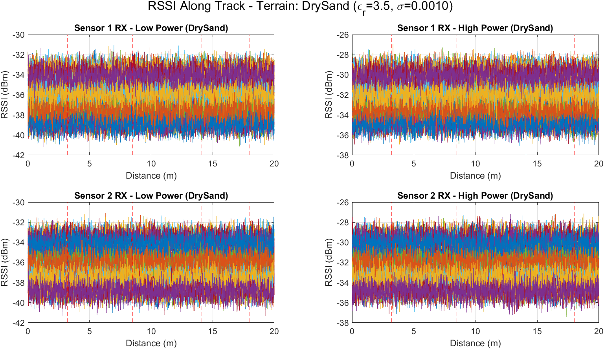 | 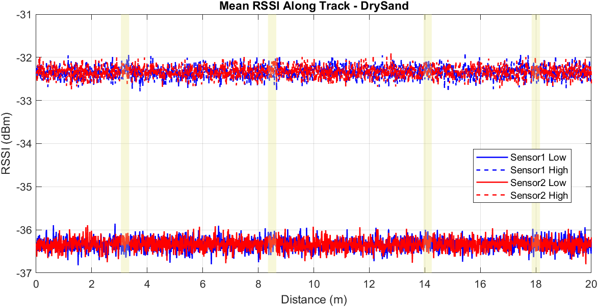 |
| Grassy Soil | 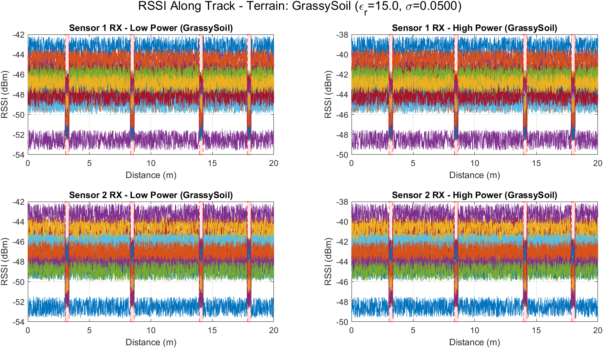 | 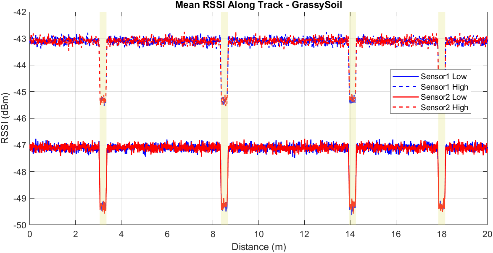 |
| Rocks | 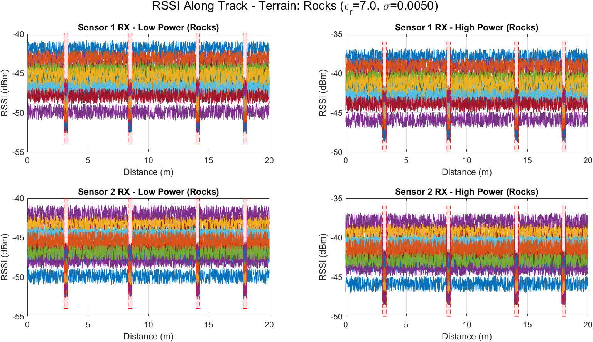 | 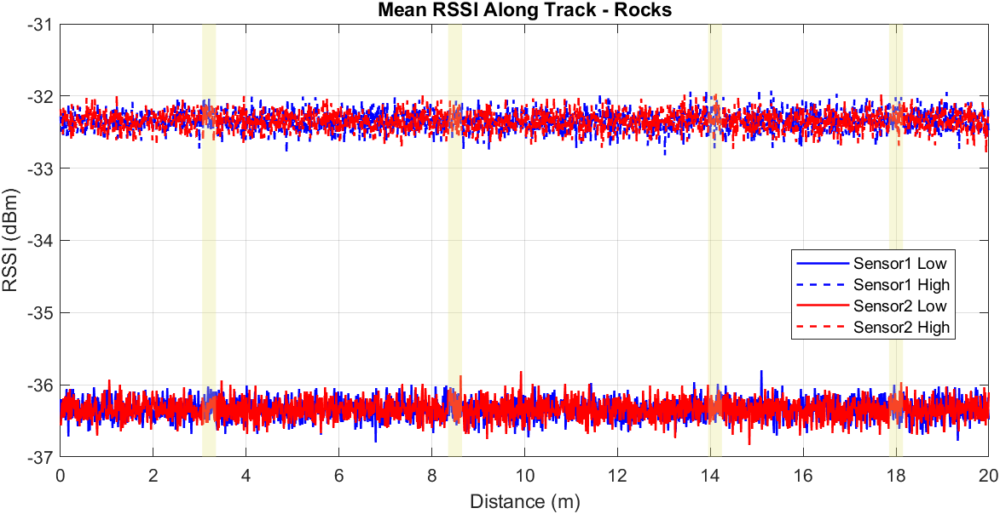 |

The red shaded regions indicate object (void) locations. Over voids, RSSI drops significantly for terrains with high permittivity (Grassy Soil shows the largest contrast due to εr = 15).

### Statistical Features Along Track

| Terrain | Sensor 1 Stats | Sensor 2 Stats |
|---------|---------------|----------------|
| Dry Sand | 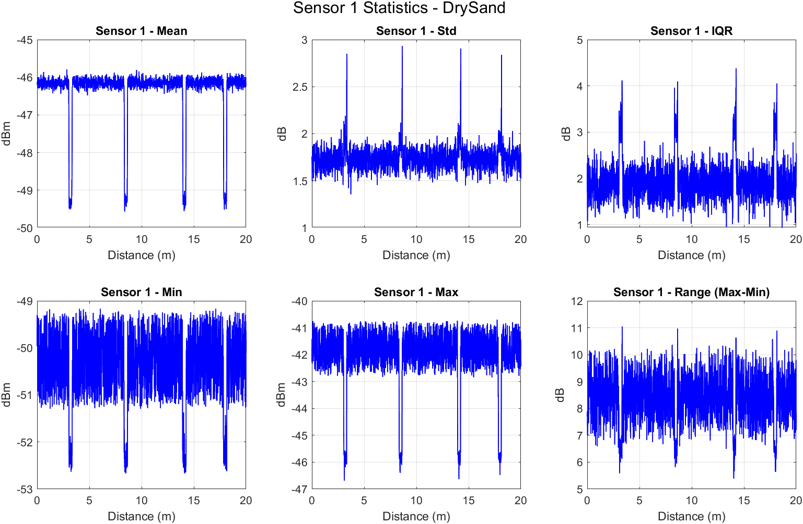 | 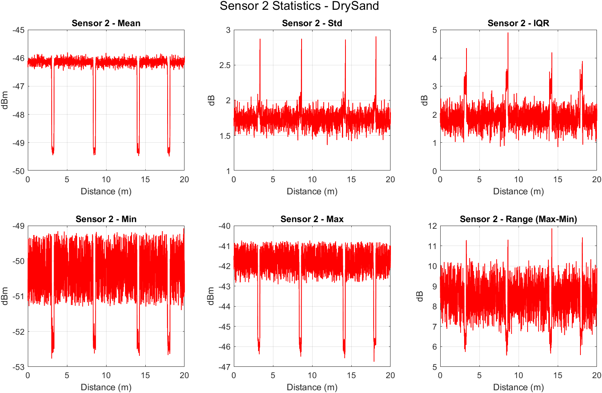 |
| Grassy Soil | 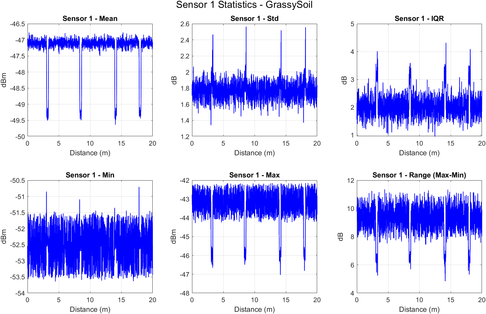 | 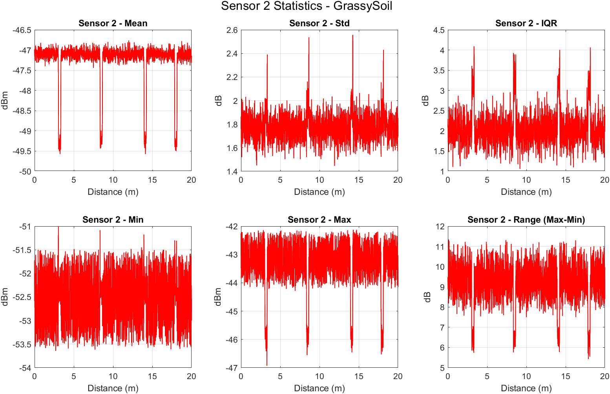 |
| Rocks | 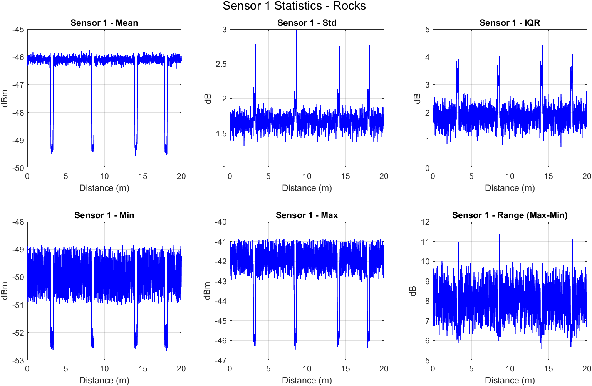 | 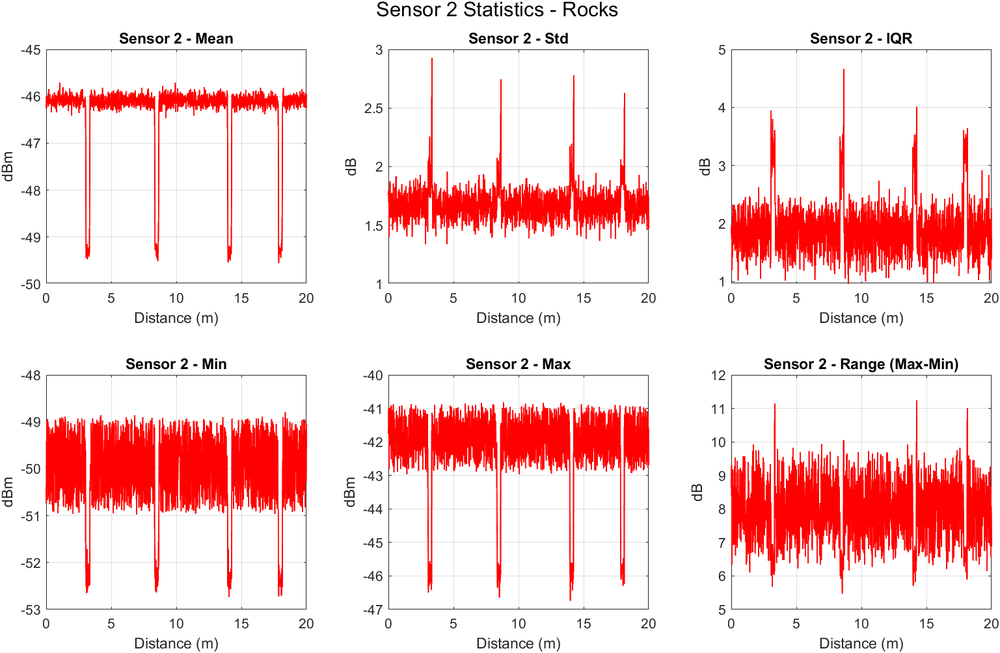 |

### Between-Sensor Comparison

| Dry Sand | Grassy Soil | Rocks |
|----------|-------------|-------|
| 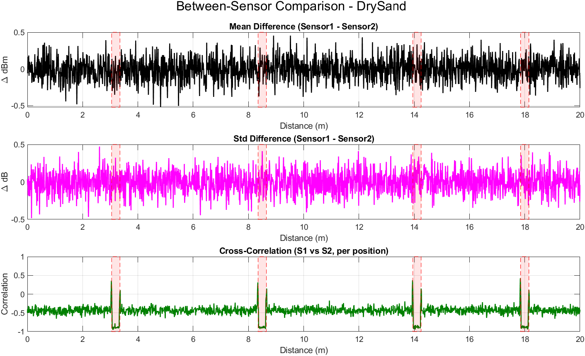 | 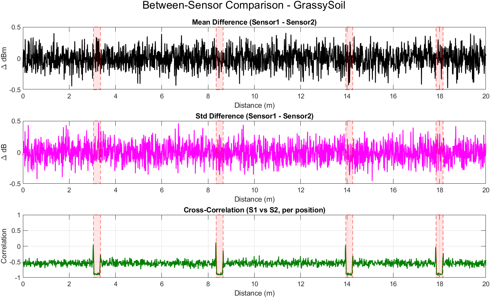 | 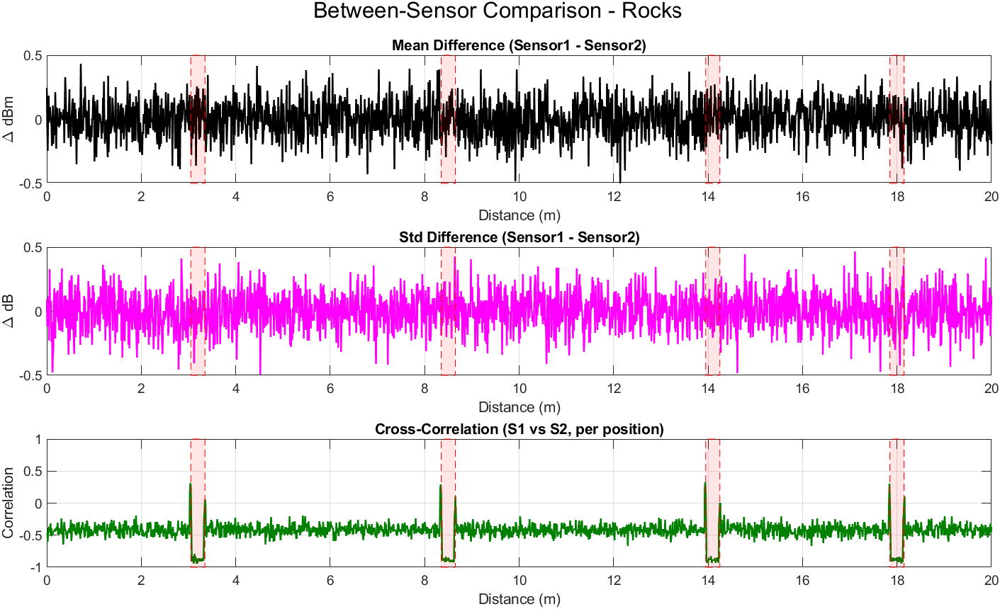 |

### Terrain Comparison

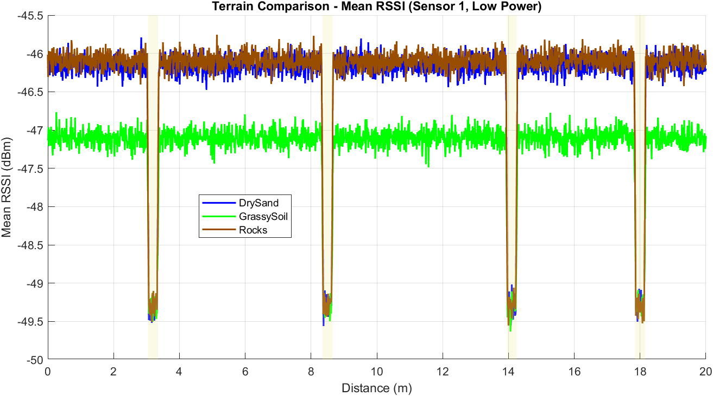

---

## Machine Learning Classification

### Problem Definition

- **6 Classes**: {DrySand, GrassySoil, Rocks} × {Object, NoObject}
- **155 Features**: 128 raw RSSI (32 antennas × 2 power levels × 2 sensors) + 27 statistical features
- **Dataset**: 6003 samples total (1877 NoObject + 124 Object per terrain)
- **Class Imbalance**: ~15:1 ratio (NoObject : Object)

### Statistical Features (27 total)

| # | Feature | Description |
|---|---------|-------------|
| 1-5 | S1 stats | Mean, Std, Min, Max, IQR of Sensor 1 low-power |
| 6-10 | S2 stats | Mean, Std, Min, Max, IQR of Sensor 2 low-power |
| 11-13 | Between-sensor | Diff mean, Diff std, Cross-correlation |
| 14-15 | High-power std | Std of high-power readings (S1, S2) |
| 16-19 | Range features | S1 range, S2 range, S1 high range, S2 high range |
| 20-21 | Ratio features | Std ratio, Diff mean high-power |
| 22-24 | Combined stats | Combined std, range, IQR across both sensors |
| 25-27 | Shape features | Kurtosis (S1, S2), Skewness difference |

### Imbalance Handling

- **Oversampling**: Minority (Object) classes duplicated with 0.02 dB noise perturbation to match majority class count
- **RUSBoost**: Random Under-Sampling with Boosting (trains directly on imbalanced data)

### Models Trained

| # | Model | Configuration |
|---|-------|---------------|
| 1 | SVM (Gaussian) | ECOC, KernelScale=auto, BoxConstraint=10, onevsone |
| 2 | MLP | 4 layers [256-128-64], 2000 iterations |
| 3 | Ensemble (AdaBoostM2) | 300 cycles, MaxNumSplits=100, LR=0.1 |
| 4 | Bagged Trees | 500 cycles, MaxNumSplits=300, MinLeafSize=1 |
| 5 | KNN | k=7, squared-inverse distance weighting |
| 6 | Two-Stage | Bagged terrain classifier + RUSBoost object detector |
| 7 | RUSBoost | 500 cycles, MaxNumSplits=100, LR=0.1, on imbalanced data |

---

## Classification Results

### Overall Metrics (80/20 Stratified Split)

| Model | Accuracy | Macro F1 | Precision | Recall | Time |
|-------|----------|----------|-----------|--------|------|
| SVM (Gaussian) | 83.25% | 0.6464 | 0.6462 | 0.6481 | 2.2s |
| MLP [256-128-64] | 78.67% | 0.6025 | 0.6018 | 0.6045 | 30.6s |
| Ensemble (Boosted) | 91.00% | 0.6823 | 0.6878 | 0.6838 | 43.7s |
| Bagged Trees | 88.33% | 0.6867 | 0.6885 | 0.6888 | 13.8s |
| KNN (k=7) | 76.33% | 0.5905 | 0.5899 | 0.5929 | 0.1s |
| Two-Stage | 86.75% | 0.6436 | 0.6433 | 0.6484 | 7.9s |
| **RUSBoost** | **89.50%** | **0.6885** | **0.6915** | **0.6877** | **9.1s** |

### Best Model: RUSBoost (F1 = 0.6885)

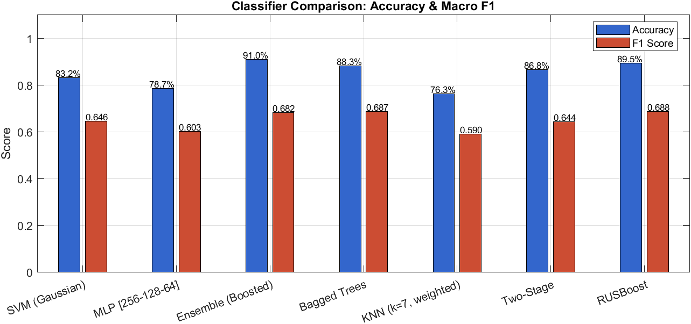

### Per-Class Performance (RUSBoost)

| Class | F1 Score | Precision | Recall | Support |
|-------|----------|-----------|--------|---------|
| DrySand_NoObject | 0.8862 | 0.8898 | 0.8827 | 375 |
| DrySand_Object | 0.4889 | 0.5238 | 0.4583 | 24 |
| GrassySoil_NoObject | 0.9973 | 0.9947 | 1.0000 | 376 |
| GrassySoil_Object | 0.4348 | 0.4545 | 0.4167 | 24 |
| Rocks_NoObject | 0.8871 | 0.8859 | 0.8883 | 376 |
| Rocks_Object | 0.4364 | 0.4000 | 0.4800 | 25 |

### Confusion Matrices

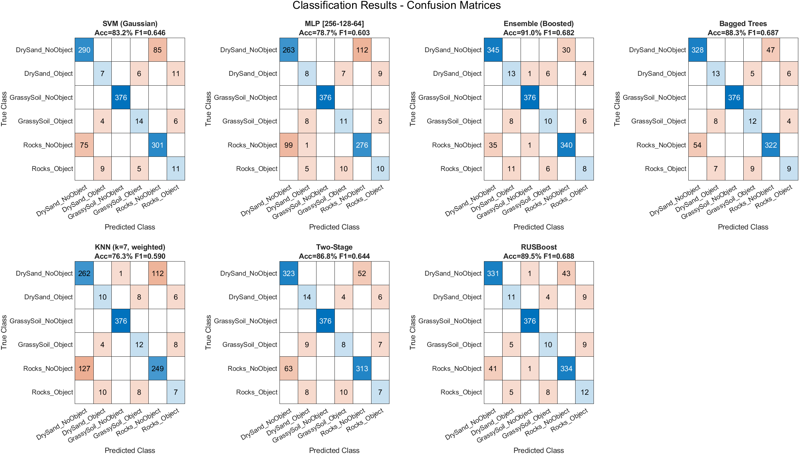

---

## Parameter Sweep Results

Five physical parameter configurations were tested to find optimal simulation settings:

| Experiment | obj_y_half | obj_x_half | PL_direct | Noise | Accuracy | F1 |
|------------|-----------|-----------|-----------|-------|----------|------|
| **Baseline** | **150 mm** | **250 mm** | **25 dB** | **0.05** | **87.92%** | **0.6540** |
| Larger objects | 300 mm | 250 mm | 25 dB | 0.05 | 83.75% | 0.6345 |
| Shallow+Wide | 250 mm | 400 mm | 28 dB | 0.03 | 87.25% | 0.6427 |
| Large+Shallow+Low Noise | 300 mm | 400 mm | 30 dB | 0.02 | 87.58% | 0.6315 |
| Max contrast | 350 mm | 500 mm | 30 dB | 0.02 | 86.00% | 0.6440 |

**Finding**: The baseline configuration produced the best results. Making objects larger paradoxically hurts performance because it shifts the class boundary statistics and adds noise to the decision surface.

---

## Advanced Tuning Results

Ten additional experiments were performed to maximize F1 through model-level tuning:

| # | Experiment | Accuracy | Macro F1 | Time |
|---|------------|----------|----------|------|
| 1 | RUSBoost (1000 cycles, deeper trees) | 90.50% | 0.6867 | 19.8s |
| 2 | RUSBoost (stats-only features) | 83.67% | 0.5728 | 4.8s |
| 3 | Bagged Trees (1000 cycles, deep) | 89.42% | 0.6740 | 28.6s |
| 4 | AdaBoostM2 (500, deep, oversampled) | 90.25% | 0.6492 | 93.2s |
| 5 | RUSBoost + Top-50 features | 86.00% | 0.5987 | 7.2s |
| 6 | MLP [512-256-128-64] | 81.00% | 0.6548 | 54.2s |
| 7 | Voting Ensemble (3 models) | 89.25% | 0.6456 | 67.0s |
| 8 | RUSBoost (2000 cycles, LR=0.01) | 90.00% | 0.6645 | 36.8s |
| 9 | Two-Stage (SVM + RUSBoost) | 81.25% | 0.6373 | 2.4s |
| 10 | Bagged Trees (cost-sensitive) | 87.75% | 0.6251 | 13.8s |

**Best from Advanced Tuning**: RUSBoost-1000-deep (F1=0.6867, Acc=90.50%)

### Insights from Advanced Tuning

- **RUSBoost dominates**: 3 of the top 4 configurations use RUSBoost, confirming it handles the 15:1 class imbalance better than oversampling approaches
- **All 155 features needed**: Stats-only (F1=0.57) and Top-50 (F1=0.60) both significantly underperform full feature set
- **Deeper trees help moderately**: 200 splits vs 100 splits improves RUSBoost slightly
- **Slow learning rate hurts**: LR=0.01 (F1=0.66) underperforms LR=0.05 (F1=0.69) despite 2x more cycles
- **Voting doesn't help**: Majority vote of 3 strong models (F1=0.65) is worse than the best individual model

---

## Key Findings

1. **Terrain Classification is Excellent**: NoObject classes achieve F1 > 0.88, with GrassySoil reaching near-perfect 0.997 due to its distinctly high permittivity creating strong Fresnel reflections.

2. **Object Detection is Challenging**: Object classes achieve F1 = 0.43–0.49. The fundamental limitation is that only ~6% of positions overlap with objects, creating extreme class imbalance (15:1 ratio).

3. **Best Overall Performance**: RUSBoost classifier achieves **Accuracy = 89.50%** and **Macro F1 = 0.6885** (from TrainClassifiers.m standard run). The highest accuracy achieved was 91.00% (Ensemble Boosted), but with lower F1.

4. **RUSBoost is the Best Approach**: Training directly on imbalanced data with Random Under-Sampling Boosting outperforms oversampling-based approaches (F1 = 0.6885 vs 0.6540 with previous classifiers).

5. **Feature Engineering Helps**: Adding 14 additional statistical features (kurtosis, range, combined sensor stats) improved the best F1 from 0.654 to 0.689 — a 5.3% relative improvement.

6. **Physical Parameters Saturated**: The parameter sweep showed that changing object size, depth, or noise doesn't significantly improve detection — the limiting factor is the inherent difficulty of detecting 30mm-deep voids from surface reflections only.

7. **All Features are Needed**: Feature selection (top-50 by importance) significantly degraded performance (F1=0.60 vs 0.69), indicating the classifier benefits from the full high-dimensional feature space.

---

## Recommendations for Future Work

1. **Multi-frequency operation**: Use multiple frequencies (e.g., 900 MHz, 2.45 GHz, 5.8 GHz) for frequency diversity — different wavelengths penetrate differently.
2. **Temporal/spatial features**: Use sliding windows along the track to capture RSSI transition patterns at object boundaries.
3. **Deeper object modeling**: Include subsurface layer reflections (not just surface Fresnel) for more realistic void signatures.
4. **Real measurement data**: Validate simulation with physical antenna measurements to calibrate pattern losses.
5. **Increase object density**: More objects in training data would help classifiers learn void signatures.

---

## Files & Scripts

| File | Purpose |
|------|---------|
| `SimConfig.m` | Shared simulation parameters (single source of truth) |
| `QuickView.m` | 3D setup visualization |
| `TrackSimulation.m` | Full RF simulation generating RSSI CSVs + plots |
| `TrainClassifiers.m` | ML model training (7 classifiers, 155 features) |
| `ParameterSweep.m` | Physical parameter optimization (5 experiments) |
| `AdvancedTuning.m` | Model hyperparameter optimization (10 experiments) |
| `GETTING_STARTED.md` | Quick-start guide |

---

*Generated: Robot RF Material Sensing Simulation V3*
