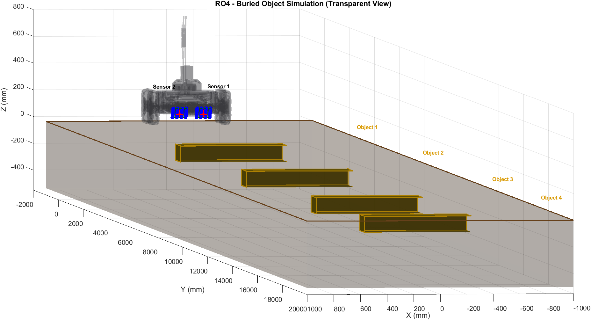
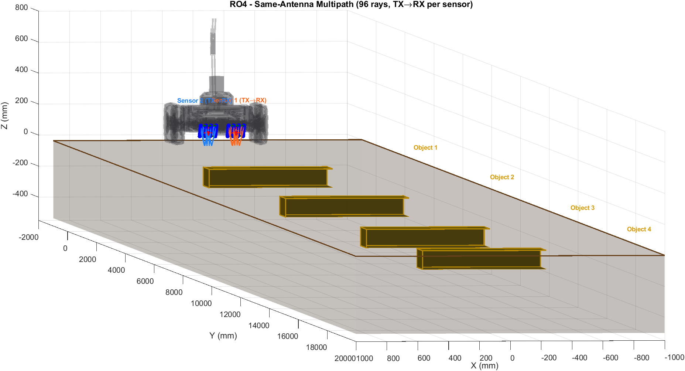

# Multipath Ray Tracing Visualization

## Overview

The multipath figures show physically computed RF ray paths between the TX and RX antenna elements in the RO4 simulation environment. These are **not hand-drawn** — they are calculated by MATLAB's built-in ray tracing engine using the Shooting and Bouncing Rays (SBR) method.

## Toolboxes Used

| Toolbox | Purpose |
|---------|---------|
| **Communications Toolbox** | `propagationModel("raytracing")`, `raytrace()`, `txsite`, `rxsite` |
| **Antenna Toolbox** | `siteviewer` (3D scene loader for ray tracing geometry) |

## How It Works

### 1. Scene Geometry (STL Creation)

A terrain box is created programmatically as an STL file matching the simulation dimensions:
- **Width**: 2000 mm (track width)
- **Length**: 21000 mm (track Y extent)
- **Depth**: 500 mm below surface

```matlab
V = [vertices defining 8 corners of box];
F = [12 triangular faces];
TR = triangulation(F, V);
stlwrite(TR, 'terrain_scene.stl');
```

The STL is loaded into `siteviewer` which provides the 3D geometry that rays bounce off.

### 2. Antenna Placement

TX and RX positions are placed using `txsite` and `rxsite` in Cartesian coordinates (meters):
- **Sensor 1**: TX at center, 32 RX elements (4×8 grid), offset X = -90 mm
- **Sensor 2**: TX at center, 32 RX elements (4×8 grid), offset X = +90 mm
- Both arrays tilted 45° toward ground, height = 95.26 mm

### 3. Propagation Model Configuration

```matlab
pm = propagationModel("raytracing", ...
    "CoordinateSystem", "cartesian", ...
    "Method", "sbr", ...
    "SurfaceMaterial", "custom", ...
    "SurfaceMaterialPermittivity", 3.5, ...   % DrySand
    "SurfaceMaterialConductivity", 0.001);
pm.MaxNumReflections = 5;
```

- **Method**: SBR (Shooting and Bouncing Rays) — launches rays from TX, traces reflections off surfaces
- **Surface Material**: Custom permittivity/conductivity matching the terrain (DrySand: εr=3.5, σ=0.001 S/m)
- **Max Reflections**: 5 bounces per ray

### 4. Ray Tracing Execution

Four sets of rays are computed:

| Trace | Description | Color |
|-------|-------------|-------|
| TX1 → RX2 | Sensor 1 transmits, Sensor 2 receives (cross) | Orange |
| TX2 → RX1 | Sensor 2 transmits, Sensor 1 receives (cross) | Blue |
| TX1 → RX1 | Sensor 1 transmits to own RX (same-antenna) | Orange |
| TX2 → RX2 | Sensor 2 transmits to own RX (same-antenna) | Blue |

```matlab
rays = raytrace(tx_site, rx_sites, pm);
```

Each call returns a cell array of `comm.Ray` objects containing:
- `TransmitterLocation` — TX position [x, y, z]
- `ReceiverLocation` — RX position [x, y, z]
- `Interactions` — reflection/diffraction points with `.Location`
- `NumInteractions` — number of bounces
- `PathLoss` — computed path loss (dB)
- `PropagationDistance` — total ray path length (m)

### 5. Path Extraction and Plotting

Ray paths are extracted and plotted as 3D lines in a standard MATLAB figure:

```matlab
for each ray:
    path = [TX_location; interaction_points; RX_location] * 1000;  % m -> mm
    plot3(path(:,1), path(:,2), path(:,3));
end
```

## Output Figures
### Clean Scene (No Rays)


### Cross-Traced Multipath (TX1→RX2, TX2→RX1 + Self)


### Same-Antenna Multipath (TX1→RX1, TX2→RX2)

| File | Description | Ray Count |
|------|-------------|-----------|
| `Setup_3D.png` | Clean scene — no rays, shows terrain + objects + robot | 0 |
| `Setup_3D_Multipath.png` | Cross-traced + self rays (all 4 combinations) | 192 |
| `Setup_3D_Multipath_SameAntenna.png` | Same-antenna only (TX1→RX1, TX2→RX2) | 96 |

## Key Parameters

| Parameter | Value |
|-----------|-------|
| Frequency | 2.45 GHz |
| Array size | 4×8 = 32 RX + 1 TX per sensor |
| PCB dimensions | 100×100 mm |
| Tilt angle | 45° |
| Sensor height | 95.26 mm |
| Sensor separation | 180 mm (±90 mm from center) |
| Max reflections | 5 |
| Surface εr | 3.5 (DrySand) |
| Surface σ | 0.001 S/m |

## Script

All multipath visualization is generated by:
```
QuickView.m  (in RobotSimulationAnalysis/)
```

Run with:
```matlab
cd RobotSimulationAnalysis
QuickView
```

Requires: Communications Toolbox + Antenna Toolbox installed.
